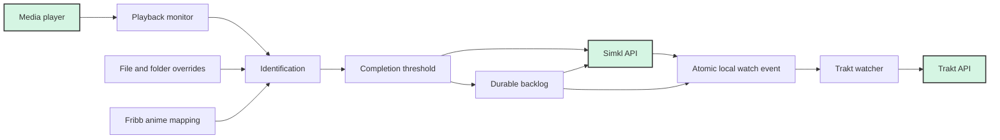

# 🎬 Media Player Scrobbler for Simkl

  
   
  <em>Automatic media tracking for all your media players</em>

## ✨ Features

- 🎮 **Supports Every Famous Media Player** (VLC, PotPlayer, MPV, MPC-HC and more)
- 🌐 **Cross-Platform** – Windows, macOS, Linux
- 🖥️ **Native Executable** – System tray, auto-update, and background service (Windows)
- 📈 **Accurate Position Tracking** – For supported players (configure via [Media Players Guide](docs/media-players.md))
- 🔌 **Durable Offline Support** – Queues distinct completed-watch events until they succeed
- 🧠 **Smart Media Detection** – Intelligent filename parsing
- 🍿 **Media-Focused** – Optimized for every type of media (Movies,TV Shows and Anime)
- ✅ **Optional Trakt Sync** – Pushes the same completed watches from local history to Trakt

## ⚡ Quick Start

- **Windows:** Use the [Windows Guide](docs/windows-guide.md) (EXE installer, tray app, no commands needed).
- **Linux:** Use the [Linux Guide](docs/linux-guide.md) (pipx recommended, tray app, setup command needed).
- **macOS:** Use the [Mac Guide](docs/mac-guide.md) (pip install, tray app, setup command needed, untested).

After installation, authenticate with SIMKL and **configure your media players** using the [Media Players Guide](docs/media-players.md) (this step is critical for accurate tracking).

To keep Trakt current from the same tray process, see the [Automatic Trakt Sync Guide](docs/trakt-sync.md).

## 🔍 How It Works

Completed events use atomic JSON replacement and last-known-good backups. Offline
events have unique keys, are never discarded after a retry count, and retain
their original watch timestamp. Trakt retries unmatched or failed events without
requiring another playback event; rate-limited requests honor `Retry-After`.

## 🚦 Performance Notes

**Online:**
- Player Detection: ~4.2 sec
- Media Info Scrobble: ~3.7 sec
- Notification: ~1.5 sec
- Completion Detection Delay: ~5.2 sec
- Completion Sync: ~13.3 sec
- Completion Notification: ~1.5 sec

**Offline:**
- Media Scrobble: ~1.2 sec
- Notification: ~0.5 sec
- Completion Save: ~3 sec
- Completion Notification: ~0.5 sec

## 📝 License

See the [LICENSE](LICENSE) file for details.

## 🤝 Contributing

Contributions are welcome! Please submit a Pull Request.

## ☕ Support & Donate

Just a little reminder! If you enjoy what I create, you can support me at https://ko-fi.com/itskavin

## 🙏 Acknowledgments

- [Simkl](https://simkl.com) – API platform
- [ByteTrix](https://github.com/ByteTrix/Media-Player-Scrobbler-for-Simkl) – Original project
- [guessit](https://github.com/guessit-io/guessit) – Filename parsing
- [iamkroot's Trakt Scrobbler](https://github.com/iamkroot/trakt-scrobbler/) – Inspiration
- [Masyk](https://github.com/masyk), [Ichika](https://github.com/ekleop) – Logo and technical guidance (SIMKL Devs)

## 🛠️ Related Tools

These tools can help organize and rename media files automatically, which can improve the accuracy and ease of scrobbling.

- [FileBot](https://www.filebot.net/) - Media File Renaming
- TVRename - TV File Data Automation (Optional)
- Shoko - Anime File Data Automation (Optional)
---

  
Made with ❤️ by <a href="https://github.com/itskavin">kavin</a>

  

    <a href="https://github.com/roko-tech/Media-Player-Scrobbler-for-Simkl/stargazers">⭐ Star us on GitHub</a> •
    <a href="https://github.com/roko-tech/Media-Player-Scrobbler-for-Simkl/issues">🐞 Report Bug</a> •
    <a href="https://github.com/roko-tech/Media-Player-Scrobbler-for-Simkl/issues">✨ Request Feature</a>
  

